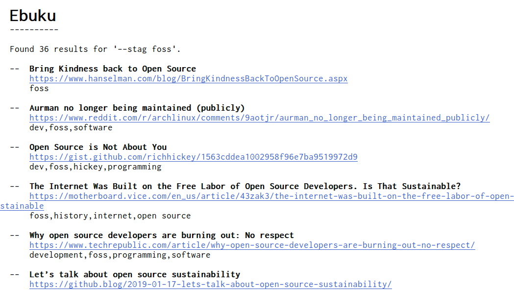

# ebuku - Interface to the buku Web bookmark manager

*Author:* Alexis <flexibeast@gmail.com>, Erik Sjöstrand <sjostrand.erik@gmail.com>, Junji Zhi [https://github.com/junjizhi] 
*Version:* 0 

Ebuku provides a basic interface to the
[buku](https://github.com/jarun/buku) Web bookmark manager.

 

## Table of Contents

- [Installation](#installation)
- [Usage](#usage)
- [Customisation](#customisation)
- [TODO](#todo)
- [Issues](#issues)
- [License](#license)

## Installation

Install [Ebuku from MELPA](https://melpa.org/#/ebuku), or put the
`ebuku` folder in your load-path and do a `(load "ebuku")`.

## Usage

Create an Ebuku buffer with <kbd>M-x ebuku</kbd>.

In the `*Ebuku*` buffer, the following bindings are available:

* <kbd>s</kbd> - Search for a bookmark (`ebuku-search`).

* <kbd>r</kbd> - Show recently-added bookmarks (`ebuku-search-on-recent`).

* <kbd>*</kbd> - Show all bookmarks (`ebuku-show-all`).

* <kbd>-</kbd> - Toggle results limit (`ebuku-toggle-results-limit`).

* <kbd>g</kbd> - Refresh the search results, based on last search (`ebuku-refresh`).

* <kbd>RET</kbd> - Open the bookmark at point in a browser (`ebuku-open-url`).

* <kbd>n</kbd> - Move point to the next bookmark URL (`ebuku-next-bookmark`).

* <kbd>p</kbd> - Move point to the previous bookmark URL (`ebuku-previous-bookmark`).

* <kbd>a</kbd> - Add a new bookmark (`ebuku-add-bookmark`).

* <kbd>d</kbd> - Delete a bookmark (`ebuku-delete-bookmark`).  If point is on
  a bookmark, offer to delete that bookmark; otherwise, ask for the
  index of the bookmark to delete.

* <kbd>e</kbd> - Edit a bookmark (`ebuku-edit-bookmark`).  If point is on a
  bookmark, edit that bookmark; otherwise, ask for the index of the
  bookmark to edit.

* <kbd>C</kbd> - Copy the URL of the bookmark at point to the kill ring (`ebuku-copy-url`).

* <kbd>T</kbd> - Copy the title of the bookmark at point to the kill ring (`ebuku-copy-title`).

* <kbd>I</kbd> - Copy the index of the bookmark at point to the kill ring (`ebuku-copy-index`).

* <kbd>q</kbd> - Quit Ebuku.

Bindings for Evil are available via the
[evil-collection](https://github.com/emacs-evil/evil-collection)
package, in `evil-collection-ebuku.el`.

The index of a bookmark can be displayed in the echo area by moving
the screen pointer over the leading `--` text for the bookmark.

### Completion

Ebuku provides two cache variables for use by completion frameworks
(e.g. Ivy or Helm): `ebuku-bookmarks` and `ebuku-tags`, which can
be populated via the `ebuku-update-bookmarks-cache` and
`ebuku-update-tags-cache` functions, respectively.

## Customisation

The `ebuku` customize-group includes variables for:

* the path to the `buku` executable;

* the path to the buku database;

* the number of recently-added bookmarks to show;

* which bookmarks to show on startup;

* the maximum number of bookmarks to show;

* whether to automatically retrieve URL metadata when adding a
  bookmark; and

* the faces used by Ebuku;

* whether to use `sqlite` to refresh the `ebuku-tags` cache variable
  (requires separate installation of `sqlite3` executable).

## TODO

* One should be able to edit bookmarks directly in the `*Ebuku*`
  buffer, à la `wdired`.  Much of the infrastructure to support this
  is already in place, but there are still important details yet to
  be implemented.

## Issues / bugs

If you discover an issue or bug in Ebuku not already
noted:

* as a TODO item, or

* in [the project's "Issues" section on
  GitHub](https://github.com/flexibeast/ebuku/issues),

please create a new issue with as much detail as possible,
including:

* which version of Emacs you're running on which operating system,
  and

* how you installed Ebuku.

## License

[GNU General Public License version
3](https://www.gnu.org/licenses/gpl.html), or (at your option) any
later version.

---
Converted from `ebuku.el` by [*el2markdown*](https://github.com/Lindydancer/el2markdown).
